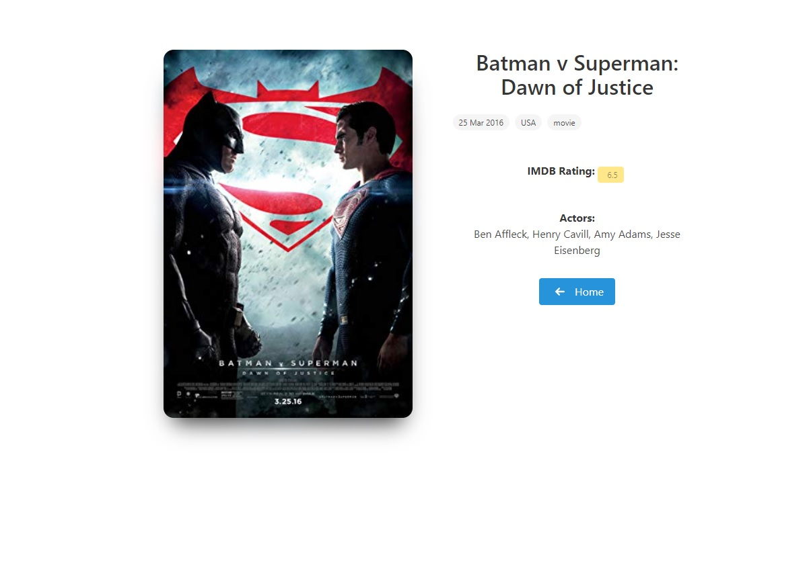

# Buscador de Pelis
Utilizando el framework, que provee Facebook, React realicé esta aplicación.

Además del uso de la API que prove [OMDb][api] para las películas.

##### Tecnologias utilizadas:
- Jsx
- Js
- HTML5
- CSS3

## Vistas

### Index
 

### Búsqueda
 

### Busqueda sin resultados
 

### Película
 

## Uso:
Basta con clonar el repositorio, dirigirse, utilizando la terminal, la carpeta donde se descargó. Ejecutar:

**yarn start**

[api]: https://www.omdbapi.com/
